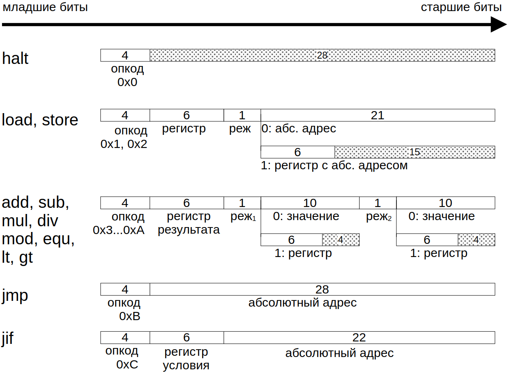
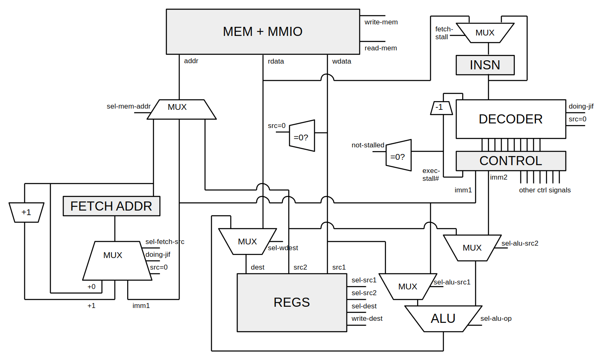
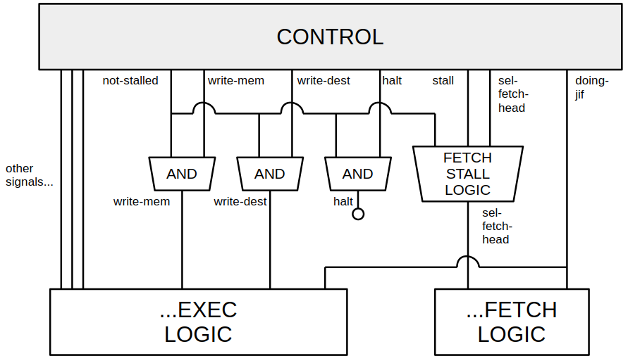

# Лабораторная №3 на C++

Соколов Иван Денисович, P33111

Вариант
```lisp | risc | neum | hw | instr | binary | stream | mem | pstr | prob5 | pipeline```

С усложнением

## Язык программирования

Язык Lisp-подобный, с S-выражениями.
Типизации нет: все выражения целочисленные, 32-битные.

```bnf
program ::= "" | paren program

paren ::= "(" expr-list ")"

expr-list ::= expr | expr expr-list

expr ::= raw-expr
raw-expr ::= paren | integer | identifier | string-literal

integer ::= "+" digit-seq | "-" digit-seq | digit-seq
digit-seq ::= digit | digit digit-seq
digit ::= "0" | "1" | ... | "8" | "9"

identifier ::= "+" | "-" | id-start id-cont
id-cont ::= (всё, кроме пробельных символов, кавычек, и "(", ")", ";")
id-start ::= (id-cont, кроме также цифр)

string-literal ::= "\"" syms-noquote "\""
syms-noquote ::= "" | sym-noquote syms-noquote
sym-noquote ::= (всё, кроме кавычек)
```
Грамматика с точностью до чувствительности к пробельным символам.
Названия правил `integer`, `identifier`, `string-literal` говорят сами за себя.

Пользовательских функций нет, распознаются встроенные:

* `if` -- условное вычисление одного из двух выражений
* `while` -- цикл
* `set` -- установить значение переменной
* `alloc-static` -- выделить статическую память
* `print-string` -- напечатать P-строку
* `read-mem` -- прочитать память по адресу
* `write-mem` -- записать в память по адресу
* `progn` -- последовательное исполнение
* Арифметика: `+`, `-`, `*`, `/`, `%`. Последний -- взятие по модулю. `+` и `*` принимают произвольное число аргументов (хотя бы два)
* Сравнения `>`, `<`, `=`

## Компилятор

Компилятор не оптимизирующий.

1. Преобразует текстовый поток в дерево ([1-parse.cpp](./compiler/1-parse.cpp))
2. Обходя дерево в аппликативном порядке, генерирует IR ([2-gen-ir.cpp](./compiler/2-gen-ir.cpp))
3. Раскрашивает значения в IR доступными регистрами ([3-codegen.cpp](./compiler/3-codegen.cpp))
4. Генерирует итоговый поток инструкций, преобразуя "высокоуровневые" IR-операции в инструкции ([3-codegen.cpp](./compiler/3-codegen.cpp))
5. Формирует финальный образ, готовый к загрузке в память процессора

IR тоже является потоком инструкций, но отличается от ISA процессора:
* IR оперирует над абстрактными переменными, которых может быть сколько угодно
* в IR есть `mov`, в ISA нет. Компилятор подбирает последовательность инструкций
в зависимости от того, отражены операнды в регистр, в память или в константу.
Например, `r0 <- r1` можно записать в ISA через `add`: `r0 <- r1 + 0`.
* и в IR, и в процессоре есть `store` и `load`, но в IR они генерируются только тогда,
когда исходный код явно обращается к памяти (`read-mem`, `write-mem`). На одну "явную"
операцию с памятью может прийтись до трёх в итоговом коде.

Стоит заметить, что, несмотря на неограниченное число вольно создаваемых переменных, IR
не является SSA-формой. Переменные можно переназначать после их создания. Также нет понятия
*basic block*; вся программа является одним блоком, внутри которого разрешены явные переходы.

## Процессор

Регистров 64 по 32 бита. Все регистры равноправны (хотя компилятор резервирует два под свои
нужды). Флагов нет; инструкция условного прыжка проверяет заданный (любой) регистр на
равенство нулю.

32 бита -- минимальная адресуемая единица (т.е. если считать байтом 8
бит, то 0x2 -- смещение на 8 байт, а адресуемое пространство -- 16 ГиБ).

Адресация существует только абсолютная.

Инструкции тоже по 32 бита. Существует 13 инструкций:

* `hlt` -- остановить выполнение
* бинарные операции арифметики и сравнения: `add`, `sub`, `mul`, `div`, `mod`, `equ`, `lt`, `gt`.
Принимают два входных значения и регистр-результат. Каждое входное значение может быть регистром
или константой (10 бит).
* `jmp` -- безусловный переход. Адрес -- константа (28 бит)
* `jif` -- условный переход. Адрес -- константа (22 бита), условие -- заданный регистр не 0

Схема бинарного представления инструкций:


В процессоре реализован конвеер с 3 стадиями: fetch, decode, execute.
Соответственно, конвееризующие регистры:

* между fetch и decode (полученная инструкция)
* между decode и execute (регистр с управляющими сигналами).
* между execute и fetch (регистр с адресом следующего чтения инструкции)

Любой прыжок предполагает полную остановку конвеера, т.е. вставление двух execute-пузырей.

Поскольку память одноканальная, любая операция с памятью предполагает
приостановку fetch и, следовательно, выполняется два такта.

## Организация памяти

Архитектура фон Неймана. Данные и код в одном адресном пространстве.

Было решено расположить данные в начале памяти, до кода (это упрощало компилятор).
Поскольку точка входа процессора -- адрес 0x0, то этот адрес резервируется под `jmp`
на основной код.

Адрес MMIO, привязанный к stdin/stdout эмулятора -- 0x3. Адреса 0x1 и 0x2 не используются
для MMIO, чтобы избежать конфликта с prefetch при пуске процессора.

```text
0x0    jmp 0x40 (адрес для примера, зависит от размера данных)
0x1    не используется
0x2    не используется
0x3    MMIO
--- начало данных ---
0x4    данные
...    ...
--- начало кода -----
0x40   код
...    ...
```

## Схемы процессора




## Тестирование

Производится с помощью Github actions: [ci.yml](./.github/workflows/ci.yml).

В Docker-контейнере с достаточно новой Ubuntu устанавливаются достаточно новые CMake, gcc,
clang-tidy, build-essential.

Проект конфигурируется в CI в релизе и с линтером clang-tidy. [Настройки
линтера](./clang-tidy-checks). Помимо прочего, проверяется "когнитивная сложность"
(метрика из clang-tidy, похожа на цикломатическую, но определяется по-другому).

Тесты прогоняются с помощью ctest.

## Подробный разбор программы

Рассмотрим [cat.lisp](./lisp/cat.lisp):

```
(while (set c (read-mem 3))
       (write-mem 3 c))
```

Компилятор даёт следующий код (бинарник дизассемблирован утилитой [disasm](./disasm/main.cpp)):
```text
  0: 0x0000004b jmp 0x4
  1: [ unused ]
  2: [ unused ]
  3: [ MMIO ]
  4: 0x00000403 add r0, r0, 0x0
  5: 0x00000403 add r0, r0, 0x0
  6: 0x00001801 ld r0, mem[0x3]
  7: 0x00000413 add r1, r0, 0x0
  8: 0x00000c08 equ r0, r1, 0x0
  9: 0x0000400c jif r0, 0x10
  a: 0x00000fe3 add r62, r1, 0x0
  b: 0x00001bf3 add r63, 0x3, 0x0
  c: 0x00000403 add r0, r0, 0x0
  d: 0x00000403 add r0, r0, 0x0
  e: 0x0001ffe2 st r62, mem[r63]
  f: 0x0000004b jmp 0x4
 10: 0x00000000 halt 0x0
```

Пусть входной поток содержит строку "Hi".

Тогда потактовая трассировка процессора такая:
```text
After tick 0:
  Mem: addr=0xffffffff, wdata=0x0, rdata=0x3
  Reg: (all 0)
  Fetch head=0x0 insn=0x3
  Control: src1=0 src2=0 dest=0 imm1=0x0 imm2=0x0
  Decode in=0x3
After tick 1:
  Mem: addr=0x0, wdata=0x0, rdata=0x4b
  Reg: (all 0)
  Fetch head=0x1 insn=0x4b
  Control: +mem-read +dest-write src1=0 src2=0 dest=0 imm1=0x0 imm2=0x0
  Decode in=0x3
After tick 2:
  Mem: addr=0x1, wdata=0x0, rdata=0x0
  Reg: (all 0)
  Fetch head=0x2 insn=0x0
  Control: +mem-read +dest-write src1=0 src2=0 dest=0 imm1=0x0 imm2=0x0
  Decode in=0x4b
After tick 3:
  Mem: addr=0x2, wdata=0x0, rdata=0x0
  Reg: (all 0)
  Fetch head=0x4 insn=0x0
  Control: +STALL:3 +mem-read src1=0 src2=0 dest=0 imm1=0x4 imm2=0x0
  Decode in=0x0
After tick 4:
  Mem: addr=0x4, wdata=0x0, rdata=0x403
  Reg: (all 0)
  Fetch head=0x5 insn=0x403
  Control: +STALL:2 +mem-read src1=0 src2=0 dest=0 imm1=0x0 imm2=0x0
  Decode in=0x0
After tick 5:
  Mem: addr=0x5, wdata=0x0, rdata=0x403
  Reg: (all 0)
  Fetch head=0x6 insn=0x403
  Control: +STALL:1 +mem-read src1=0 src2=0 dest=0 imm1=0x0 imm2=0x0
  Decode in=0x403
After tick 6:
  Mem: addr=0x6, wdata=0x0, rdata=0x1801
  Reg: (all 0)
  Fetch head=0x7 insn=0x1801
  Control: +mem-read +dest-write src1=0 src2=0 dest=0 imm1=0x0 imm2=0x0
  Decode in=0x403
After tick 7:
  Mem: addr=0x7, wdata=0x0, rdata=0x413
  Reg: (all 0)
  Fetch head=0x8 insn=0x413
  Control: +mem-read +dest-write src1=0 src2=0 dest=0 imm1=0x0 imm2=0x0
  Decode in=0x1801
After tick 8:
  Mem: addr=0x3, wdata=0x0, rdata=0x48
  Reg: r0=0x48; (others 0)
  Fetch head=0x8 insn=0x413
  Control: +mem-read +dest-write src1=0 src2=0 dest=0 +fetch-stall imm1=0x3 imm2=0x0
  Decode in=0x413
After tick 9:
  Mem: addr=0x8, wdata=0x48, rdata=0xc08
  Reg: r0=0x48; r1=0x48; (others 0)
  Fetch head=0x9 insn=0xc08
  Control: +mem-read +dest-write src1=0 src2=0 dest=1 imm1=0x0 imm2=0x0
  Decode in=0x413
After tick 10:
  Mem: addr=0x9, wdata=0x48, rdata=0x400c
  Reg: r0=0x48; r1=0x48; (others 0)
  Fetch head=0xa insn=0x400c
  Control: +mem-read +dest-write src1=0 src2=0 dest=1 imm1=0x0 imm2=0x0
  Decode in=0xc08
After tick 11:
  Mem: addr=0xa, wdata=0x48, rdata=0xfe3
  Reg: r1=0x48; (others 0)
  Fetch head=0xb insn=0xfe3
  Control: +mem-read +dest-write src1=1 src2=0 dest=0 imm1=0x0 imm2=0x0
  Decode in=0x400c
After tick 12:
  Mem: addr=0xb, wdata=0x0, rdata=0x1bf3
  Reg: r1=0x48; (others 0)
  Fetch head=0xc insn=0x1bf3
  Control: +mem-read src1=0 src2=0 dest=0 +jif imm1=0x10 imm2=0x0
  Decode in=0xfe3
After tick 13:
  Mem: addr=0xc, wdata=0x0, rdata=0x403
  Reg: r1=0x48; r62=0x48; (others 0)
  Fetch head=0xd insn=0x403
  Control: +mem-read +dest-write src1=1 src2=0 dest=62 imm1=0x0 imm2=0x0
  Decode in=0x1bf3
After tick 14:
  Mem: addr=0xd, wdata=0x0, rdata=0x403
  Reg: r1=0x48; r62=0x48; r63=0x3; (others 0)
  Fetch head=0xe insn=0x403
  Control: +mem-read +dest-write src1=0 src2=0 dest=63 imm1=0x3 imm2=0x0
  Decode in=0x403
After tick 15:
  Mem: addr=0xe, wdata=0x0, rdata=0x1ffe2
  Reg: r1=0x48; r62=0x48; r63=0x3; (others 0)
  Fetch head=0xf insn=0x1ffe2
  Control: +mem-read +dest-write src1=0 src2=0 dest=0 imm1=0x0 imm2=0x0
  Decode in=0x403
After tick 16:
  Mem: addr=0xf, wdata=0x0, rdata=0x4b
  Reg: r1=0x48; r62=0x48; r63=0x3; (others 0)
  Fetch head=0x10 insn=0x4b
  Control: +mem-read +dest-write src1=0 src2=0 dest=0 imm1=0x0 imm2=0x0
  Decode in=0x1ffe2
After tick 17:
  Mem: addr=0x3, wdata=0x48, rdata=0x4b
  Reg: r1=0x48; r62=0x48; r63=0x3; (others 0)
  Fetch head=0x10 insn=0x4b
  Control: +mem-write src1=63 src2=62 dest=0 +fetch-stall imm1=0x0 imm2=0x0
  Decode in=0x4b

.............

After tick 32:
  Mem: addr=0x3, wdata=0x69, rdata=0x4b
  Reg: r1=0x69; r62=0x69; r63=0x3; (others 0)
  Fetch head=0x10 insn=0x4b
  Control: +mem-write src1=63 src2=62 dest=0 +fetch-stall imm1=0x0 imm2=0x0
  Decode in=0x4b
After tick 33:
  Mem: addr=0x10, wdata=0x0, rdata=0x0
  Reg: r1=0x69; r62=0x69; r63=0x3; (others 0)
  Fetch head=0x4 insn=0x0
  Control: +STALL:3 +mem-read src1=0 src2=0 dest=0 imm1=0x4 imm2=0x0
  Decode in=0x4b
After tick 34:
  Mem: addr=0x4, wdata=0x0, rdata=0x403
  Reg: r1=0x69; r62=0x69; r63=0x3; (others 0)
  Fetch head=0x5 insn=0x403
  Control: +STALL:2 +mem-read src1=0 src2=0 dest=0 imm1=0x4 imm2=0x0
  Decode in=0x0
After tick 35:
  Mem: addr=0x5, wdata=0x0, rdata=0x403
  Reg: r1=0x69; r62=0x69; r63=0x3; (others 0)
  Fetch head=0x6 insn=0x403
  Control: +STALL:1 +mem-read src1=0 src2=0 dest=0 imm1=0x0 imm2=0x0
  Decode in=0x403
After tick 36:
  Mem: addr=0x6, wdata=0x0, rdata=0x1801
  Reg: r1=0x69; r62=0x69; r63=0x3; (others 0)
  Fetch head=0x7 insn=0x1801
  Control: +mem-read +dest-write src1=0 src2=0 dest=0 imm1=0x0 imm2=0x0
  Decode in=0x403
After tick 37:
  Mem: addr=0x7, wdata=0x0, rdata=0x413
  Reg: r1=0x69; r62=0x69; r63=0x3; (others 0)
  Fetch head=0x8 insn=0x413
  Control: +mem-read +dest-write src1=0 src2=0 dest=0 imm1=0x0 imm2=0x0
  Decode in=0x1801
After tick 38:
  Mem: addr=0x3, wdata=0x0, rdata=0x0
  Reg: r1=0x69; r62=0x69; r63=0x3; (others 0)
  Fetch head=0x8 insn=0x413
  Control: +mem-read +dest-write src1=0 src2=0 dest=0 +fetch-stall imm1=0x3 imm2=0x0
  Decode in=0x413
After tick 39:
  Mem: addr=0x8, wdata=0x0, rdata=0xc08
  Reg: r62=0x69; r63=0x3; (others 0)
  Fetch head=0x9 insn=0xc08
  Control: +mem-read +dest-write src1=0 src2=0 dest=1 imm1=0x0 imm2=0x0
  Decode in=0x413
After tick 40:
  Mem: addr=0x9, wdata=0x0, rdata=0x400c
  Reg: r62=0x69; r63=0x3; (others 0)
  Fetch head=0xa insn=0x400c
  Control: +mem-read +dest-write src1=0 src2=0 dest=1 imm1=0x0 imm2=0x0
  Decode in=0xc08
After tick 41:
  Mem: addr=0xa, wdata=0x0, rdata=0xfe3
  Reg: r0=0x1; r62=0x69; r63=0x3; (others 0)
  Fetch head=0xb insn=0xfe3
  Control: +mem-read +dest-write src1=1 src2=0 dest=0 imm1=0x0 imm2=0x0
  Decode in=0x400c
After tick 42:
  Mem: addr=0xb, wdata=0x1, rdata=0x1bf3
  Reg: r0=0x1; r62=0x69; r63=0x3; (others 0)
  Fetch head=0x10 insn=0x1bf3
  Control: +mem-read src1=0 src2=0 dest=0 +jif imm1=0x10 imm2=0x0
  Decode in=0xfe3
After tick 43:
  Mem: addr=0x10, wdata=0x1, rdata=0x0
  Reg: r0=0x1; r62=0x69; r63=0x3; (others 0)
  Fetch head=0x11 insn=0x0
  Control: +STALL:2 +mem-read src1=1 src2=0 dest=62 imm1=0x0 imm2=0x0
  Decode in=0x1bf3
After tick 44:
  Mem: addr=0x11, wdata=0x1, rdata=0xbadf00d
  Reg: r0=0x1; r62=0x69; r63=0x3; (others 0)
  Fetch head=0x12 insn=0xbadf00d
  Control: +STALL:1 +mem-read src1=0 src2=0 dest=63 imm1=0x3 imm2=0x0
  Decode in=0x0
Ticked: 45, stalled: 11
```
Заметим, что из 45 тактов процессор простаивал в "пузырях" всего 11. В остальное время мы
достигали заветного показателя в одну инструкцию/такт -- втрое большая пропускная
способность, чем без конвеера.

## Аналитика

```text
| Соколов Иван Денисович | hello        | 1  | 144 | 36  | - | 198 | lisp | risc | neum | hw | instr | binary | stream | mem | pstr | prob5 | pipeline |
| Соколов Иван Денисович | cat          | 2  | 68  | 17  | - | 45  | lisp | risc | neum | hw | instr | binary | stream | mem | pstr | prob5 | pipeline |
| Соколов Иван Денисович | hello_user   | 11 | 632 | 158 | - | 923 | lisp | risc | neum | hw | instr | binary | stream | mem | pstr | prob5 | pipeline |
```
